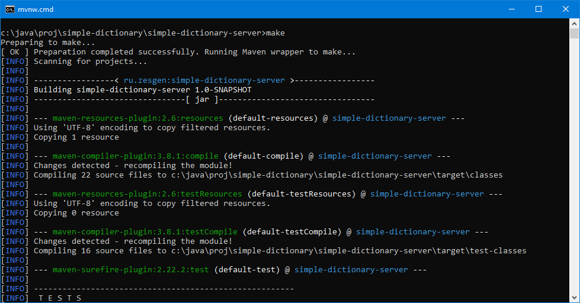
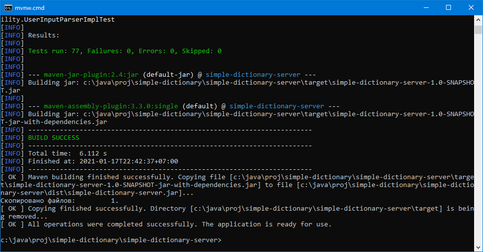
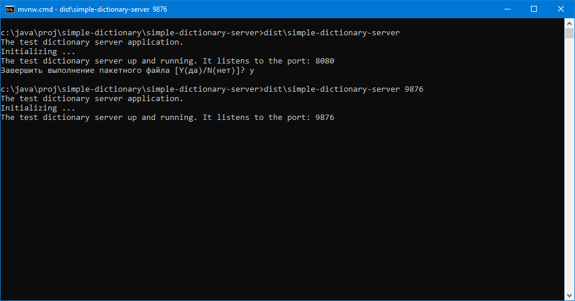
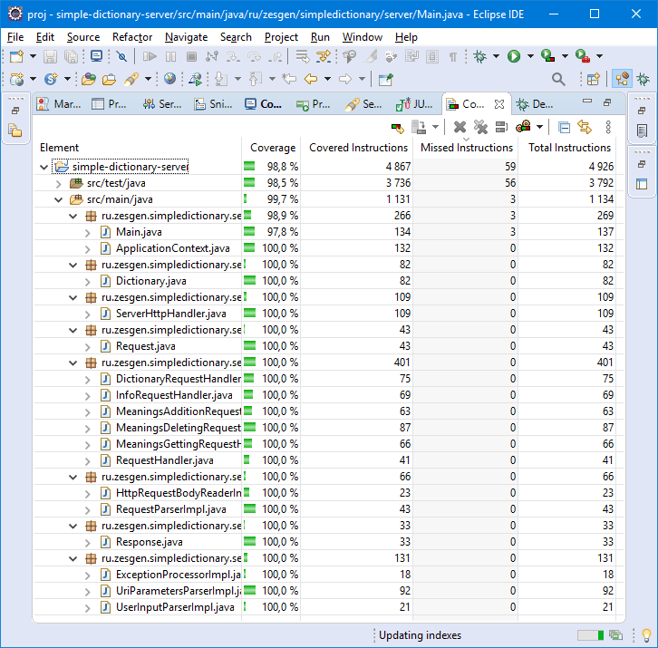
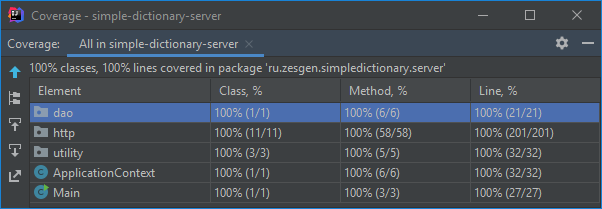

# Simple Dictionary Server

## Application description
This is the server part of the simple client-server dictionary application


## Content of the application directory
This directory contents source code and other files for the "simple-dictionary-server" application:
* `/.mvn/` - directory containing the files needed by the [Maven-Wrapper tool](https://github.com/takari/maven-wrapper) to make the application from source code;
* `/dist/` - directory containing launching scripts and intended for storing binary files;
* `/dist/simple-dictionary-server.bat` - Windows command line script for run application;
* `/dist/simple-dictionary-server` - Linux, Unix, Mac OS terminal script for run application;
* `/doc/` - directory containing some materials for using in this readme-file;
* `/src/` - directory containing source code and Unit-tests of the application;
* `make.bat` - Windows command line script for make the application from source files and put the result into `dist` directory;
* `make` - Linux, Unix, Mac OS terminal script for make the application from source files and put the result into `dist` directory;
* `mvnw` - Linux, Unix, Mac OS terminal script for Maven-Wrapper tool to make the application from source code, it is needed to `make`;
* `mvnw.cmd` - Windows command line script for Maven-Wrapper tool to make the application from source code, it is needed to `make.bat`;
* `pom.xml` - file that contains information about the project and configuration details used by [Maven tool](https://maven.apache.org/) to make the application;
* `README.md` - this file.


## Make application from source codes
For make application from source code run the make script:
 * `make.bat` - from Windows;
 * `./make` - from Linux, Unix, Mac OS.

The script will create the `.jar` file of the application.

To make an application, your system must be connected to the Internet and must have JDK8 or later installed.
Link to get JDK8: https://www.oracle.com/java/technologies/javase/javase-jdk8-downloads.html

In Debian Linux you should try command `apt-get install default-jdk` in terminal to install last supported JDK.

While the script is running, it will create directories listed below: 
* `/target/` - directory inside the application directory;
* `/.m2/` - directory inside your home directory.

The `/target/`directory will contain the compiled files, application test results and other auxiliary data. The directory will be deleted upon completion of the script. If you want the directory to be saved after building the application, call the script with the `-kt`(keep target) parameter, e.g. as follows (in Linux):
```
./make -kt
```

The `/.m2/` directory will contain Internet-downloaded files of [Maven-Wrapper](https://github.com/takari/maven-wrapper) and [Maven](https://maven.apache.org/) tools and other program components for make the application, run Unit-tests and other building things. You may delete the `/.m2/` directory after the application is made.

Among huge number of operations you'll see, Maven tool will run the Unit-tests available for the application and put their results in the folder `/target/surefire-reports/`. Additionally, in the folder `/target/site/jacoco/` will be generated a set of web pages with information about covering the source code of the application with the tests. To view it, run the file `/target/site/jacoco/index.html` in your browser.

Refer to the [Application making examples](#Application-making-examples) section for examples of the making script usage.


## Usage
To run the application, simply run the script of the same name from the `dist` directory with or without a parameter.

Usage: `simple-dictionary-server [port]`.

Usage in Linux, Unix, Mac OS: `./simple-dictionary-server [port]`.

Where `port` is the optional port of the server to listen to (from 1 to 65535).

If the parameter `port` is not specified the default port 8080 will be used.

To run an application, your system must have JRE8 or later installed.
Link to get it: https://www.oracle.com/java/technologies/javase-jre8-downloads.html

In Debian Linux you should try command `apt-get install default-jre` in terminal to install last supported JRE.


## Application making examples

The examples below are obtained when launching the making scripts without the parameter `-kt`, so the folder `/tagret/` created during the build is deleted at the end of the script.

On Windows:






## Application running examples

On Windows;




## Unit-tests and code coverage

The unit-tests are in the`/src/test/java/` directory. To run the tests you should use JUnit5, Mockito and AssertJ libraries which can be obtained via Maven.

The images below give an idea of unit-test coverage of the application code.

In  Eclipse:



In  IntelliJ IDEA:


